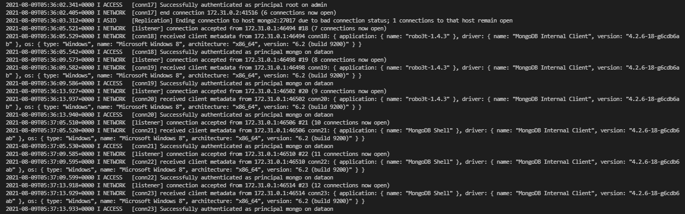

# 데이터온 엘라스틱 서치 구축

## 버전

```bash
docker v20.10.5
docker-compose v1.29.0
mongodb v4.0
Elasticsearch v6.8.14
Monstache v5
```

</br></br>

## 주의사항

```bash
# MongoDB
- MongoDB가 최초 생성되어 데이터가 생성되면 그 이후에 환경변수 변경해도 적용 안되므로 삭제 후 진행해야 함
- Mongodb string URL로 연결시 특수문자는 [Percentage Encoding](https://www.url-encode-decode.com/)을 사용해야 함!
- MongoDB Replication설정시 권한설정이 핵심! 그리고, Replication 연결 후 계정생성같은 작업해야 함


# Monstache
- Monstache에 한번 연결된 Collection이 삭제(drop)되고 생성되면 Monstache restart 해줘야 ES에 데이터 반영됨
    -- 그래서 왠만하면 db.searches.remove({})를 사용하여 document만 지움


# Elastic Search
- 기존 엘라스틱서치, mongodb가 운영중일 때도 index 컨트롤 가능해야함
- 정기적으로 데이터 저장용량 확인
- 마스터 후보를 노드는 1개만 설정하면 안 되고 최소 3개 이상의 홀수개로 설정해야 함
- minimum_master_nodes 값은 (전체 마스터 후보 노드 / 2) + 1 개로 설정되어야 함
- 전처리된 데이터가 아니면 항상 _source의 값은 변경되지 않음
- 기본 설정들은 인덱스를 처음 생성할 때 명시
- 어떤 설정들은 운영 도중에도 바꿀 수 있지만 대부분의 설정들은 한번 지정하면 변경이 되지 않는 경우가 많음
- 샤드 수는 6.x 버전 까지는 디폴트로 5개가 설정되었고, 7.0 부터는 디폴트 1개로 설정
- 샤드 수를 바꾸려면 새로 인덱스를 정의하고 기존 인덱스의 데이터를 재색인 해야 함
- replicas의 수는 설정은 다이나믹하게 변경이 가능
- Elasticsearch는 데이터를 저장할 때 다음과 같이 역 인덱스(inverted index)라는 구조를 만들어 저장
- Elasticsearch에 저장되는 도큐먼트는 모든 문자열(text) 필드 별로 역 인덱스를 생성
- Elasticsearch의 애널라이저는 0~3개의 캐릭터 필터(Character Filter)와 1개의 토크나이저(Tokenizer), 그리고 0~n개의 토큰 필터(Token Filter)로 이루어짐
- whitespace 토크나이저 그리고 lowercase, stop, snowball 토큰필터들을 조합한 것 것이 snowball 애널라이저
몽고DB 컨트롤없이 인덱스 재생성


## 1. nori
nori 설치시 적용하려면 Index mapping에 analyzer추가해야 함


## 2. index
- 인덱스는 한번 생성하면 수정하는게 거의 불가능하니 신중하게 작성. 또, reindex와 alias를 적절하게 사용하여 downtime 낮춤
- 인덱스를 지워도 연결되어 있는 Collection 자체를 삭제하지 않으면 다시 복구가능(단, 별도 Option(resume = true)이 없으면 연결된 시점 이후부터 추가된 데이터만 ES에 반영됨)
- 인덱스를 지우면 alias도 같이 지워지기 때문에 다시 생성해주어야 함
- 인덱스를 close하면 MongoDB에서 데이터 삽입해도 동기화 안됨(꼭 open상태에서 동기화 진행!)
- alias로 인덱스를 묶으면 검색시 중복데이터 발생이슈 있음


## 3. settings
- 노멀라이저는 애널라이저와 유사하게 settings 에서 정의하며 토크나이저는 적용할 수 없고 캐릭터 필터와 토큰 필터만 적용해서 사용이 가능


## 4. mappings
- 각 Field의 타입을 인지하여 매핑정보 미리생성
- 각 Field의 적절한 분석기 파악
- 제외할 품사 및 불용어 파악
- 매핑에 아무 설정을 하지 않는 경우 디폴트로 적용되는 애널라이저는 standard 애널라이저


## 5. type
### 5-1. text
- 보통은 풀텍스트 검색에 사용할 문자열 필드 들을 text 타입으로 지정
- "fielddata": true 설정이 되면 쿼리에 메모리 사용량이 많아지기 때문에 집계와 정렬은 항상 keyword 필드로 사용하는 것을 권장

### 5-2. keyword
애널라이저를 사용하지 않는 대신 노멀라이저(normalizer)의 적용이 가능

### 5-3. Multi Field
Multi Field는 하나의 텍스트 필드에 여러 개의 애널라이저를 적용하기 위해서도 사용

### 5-4. nested
- 만약에 object 타입 필드에 있는 여러 개의 object 값들이 서로 다른 역 색인 구조를 갖도록 하려면 nested 타입으로 지정해야 함
- nested 필드를 검색 할 때는 반드시 nested 쿼리를 써야 함

### 5-5. date
date type에서 매핑의 format 형식만 지정 해 놓으면 지정된 어떤 형식으로도 색인 및 쿼리가 가능함

### 5-6 number
scaled_float type은 통화 (예: '$19.99') 같이 소수점 자리가 고정된 값을 표시할 때 유용

### 5-7 range
- 쿼리의 날짜 포맷을 다르게 하고 싶으면 format 옵션의 사용이 가능
- || 을 사용해서 여러 값의 입력이 가능

### 5-8 bool
- must : 쿼리가 참인 도큐먼트들을 검색
- must_not : 쿼리가 거짓인 도큐먼트들을 검색
- should : 검색 결과 중 이 쿼리에 해당하는 도큐먼트의 점수를 높임
- filter : 쿼리가 참인 도큐먼트를 검색하지만 스코어를 계산하지 않습니다. must 보다 검색 속도가 빠르고 캐싱이 가능


## 6. search
- _all은 시스템 사용을 위한 인덱스 같은 곳의 데이터까지 접근하여 불필요한 작업 부하를 초래하므로 \_all 은 되도록 사용하지 않도록 함
- term 쿼리는 입력한 검색어는 애널라이저를 적용하지 않고 입력된 검색어 그대로 일치하는 텀을 찾음
- 풀 텍스트 검색은 스코어 점수 기반으로 정확도(relevancy)가 높은 결과부터 가져옴
- Exact Value 에는 term, range 와 같은 쿼리들이 이 부분에 속하며, 스코어를 계산하지 않기 때문에 보통 bool 쿼리의 filter 내부에서 사용
- 검색 시 쿼리를 넣지 않으면 elasticsearch는 자동으로 match_all을 적용해서 해당 인덱스의 모든 도큐먼트를 검색
- match 쿼리는 풀 텍스트 검색에 사용되는 가장 일반적인 쿼리
- match_phrase 구문을 공백을 포함해 정확히 일치하는 내용을 검색
- 본문 검색에서 여러 쿼리를 조합하기 위해서는 상위에 bool 쿼리를 사용하고 그 안에 다른 쿼리들을 넣는 식으로 사용이 가능
- 도큐먼트 내에 검색된 텀(term)이 더 많을수록 점수가 높아지는 것을 Term Frequency
- 검색한 텀을 포함하고 있는 도큐먼트 개수가 많을수록 그 텀의 자신의 점수가 감소하는 것을 Inverse Document Frequency
- 도큐먼트에서 필드 길이가 큰 필드 보다는 짧은 필드에 있는 텀의 비중이 클 것(Field Length)
- 텍스트 분석(Analysis) 과정은 검색에 사용되는 역 인덱스에만 관여합니다. 원본 데이터는 변하지 않으므로 쿼리 결과의 _source 항목에는 항상 원본 데이터가 나옴
- keyword 와 뒤에 설명할 range 쿼리와 같이 스코어 계산이 필요하지 않은 쿼리들은 모두 filter 안에 넣어서 실행하는 것이 좋음


## 7. document
도큐먼트id의 자동 생성은 PUT 메서드로는 동작하지 않음
```

</br></br>

## 설치


[그림1. 하단의 1-7 프로세스의 로그화면]

</br>

```bash
# 실행순서
# 1) openssl -> mongo1 -> mongo2, mongo3 -> mongosetup
# 2) elasticsearch -> kibana -> monstache

# 1. Mongo Replication 설치
## 1-1. MongoDB 관련한 환경변수 관리파일인 .env작성(최초 한번만 실행!)
touch mongodb/.env | cat > mongodb/.a<< EOF
MONGO_HOST=localhost
MONGO_PORT=27020
MONGO_INITDB_ROOT_USERNAME=root
MONGO_INITDB_ROOT_PASSWORD=Input the Password!!!
MONGO_INITDB_DATABASE=admin
EOF

## 1-2. 실행파일 권한 부여(최초 한번만 실행!)
chmod +x mongodb/init/*.sh

## 1-2. 기존 데이터 존재시 삭제(Options)
sudo rm -rf mongodb/mongo1 mongodb/mongo2 mongodb/mongo3

## 1-3. 데이터 저장 디렉토리 생성(Options)
mkdir -p mongodb/mongo1 mongodb/mongo2 mongodb/mongo3

## 1-4. external network 생성
docker network create elastic-network

## 1-5. MongoDB Replication 컨테이너's 삭제
docker-compose -f docker-compose.mongo.repl.yml down

## 1-6. MongoDB Replication 컨테이너's 생성
docker-compose -f docker-compose.mongo.repl.yml up -d --remove-orphans --force-recreate --build

## 1-7. MongoDB Replication Primary DB 로그 확인
## Second, Third DB와 연결이 모두되야지 다음과정 진행할 수 있음
## 상위의 그림1. 참조
docker logs -f mongo-repl-mongo1


# 2. Elastic Search 설치
## 2-1. 기존 데이터 존재시 삭제(Options)
rm -rf elasticsearch/data

## 2-2. Elastic Search 데이터 저장 디렉토리 생성(Options)
mkdir -p elasticsearch/data

## 2-3. 데이터 저장 디렉토리 권한 부여(Options)
chmod 777 elasticsearch/data

## 2-4. 컨테이너's(Elastic Search, Kibana, Monstache) 삭제
docker-compose -f docker-compose.elastic.yml down

## 2-5. 컨테이너's(Elastic Search, Kibana, Monstache) 생성
docker-compose -f docker-compose.elastic.yml up -d

## 2-6. 컨테이너's(Elastic Search, Kibana, Monstache) 로그 확인
## Monstache의 로그를 중점적으로 확인필요!
docker logs -f elasticsearch
docker logs -f kibana
docker logs -f monstache


# 3. Nori(한글형태소 분석기) 설치
## 3-1. Elastic Search 컨테이너 접속
docker exec -it elasticsearch bash

## 3-2. Nori 플러그인 설치
bin/elasticsearch-plugin install analysis-nori
exit

## 3-3. Elastic Search 컨테이너 재시작
docker restart elasticsearch

# 4. index mapping 설정
# elasticsearch/documents/Index_API.http 참조

## 4-0. 파일로 index mapping 추가
curl -XPUT http://localhost:9200/dataon.searches -H 'Content-Type: application/json' -d @elasticsearch/init/index_mapping.json


## 4-1. Reindex alias 생성
curl -XPOST http://localhost:9200/_aliases?pretty -H 'Content-Type: application/json' -d \
'{
  "actions" : [
        { "add" : { "index" : "dataon.searches", "alias" : "searches" } }
    ]
}'


# 5. 데이터 복원
## 5-1. 백업(Options)
## mongodump -u "username" -p "password" --authenticationDatabase=admin --out "dumpfile location" --gzip
docker exec -it mongo-repl-mongo1 mongodump -u admin -p "Input the Password!!!" -h db.openmate-on.co.kr --port=27020 --authenticationDatabase=admin --gzip --archive=/dump/dataon.mongo.gz

## 5-2. 복원
docker exec -it mongo-repl-mongo1 mongorestore -u admin -p "Input the Password!!!" --gzip --drop --archive=/dump/dataon.mongo.gz


# 6. 테스트
## 6-1. 인덱스 목록
curl -XGET http://localhost:9200/_cat/indices?v

## 6-2. alias 목록
curl -XGET http://localhost:9200/_cat/aliases?v

curl -XGET http://localhost:9200/dataon.searches?pretty
curl -XGET http://localhost:9200/searches?pretty

## 6-3. settings 조회
curl -XGET http://localhost:9200/dataon.searches/_settings?pretty

## 6-3. mappings 조회
curl -XGET http://localhost:9200/dataon.searches/_mappings?pretty

## 6-4. Collection 조회
curl -XGET http://localhost:9200/dataon.searches/_search?pretty -H 'Content-Type: application/json'
```

</br></br>

## 시나리오

```bash
# 1. Monstach와 연결된 Index의 mapping 정보를 재적용하고 싶을 경우
## 1-1. dataon.searches index 삭제
curl -XDELETE http://localhost:9200/dataon.searches


## 1-2. dataon.searches index mapping 생성
curl -XPUT http://localhost:9200/dataon.searches -H 'Content-Type: application/json' -d @elasticsearch/init/index_mapping.json


## 1-3. indexes 확인
curl -XGET http://localhost:9200/_cat/indices?v


## 1-4. dataon.searches index mapping 정보확인
curl -XGET http://localhost:9200/dataon.searches?pretty


# 1-5. 서버 접속 및 monstache 재시작
ssh postgres@db.openmate-on.co.kr -p10022

su

docker restart monstache


## 1-4. dataon.searches 데이터 건수
curl -XGET http://localhost:9200/dataon.searches/_count


# 2. Monstach와 연결되지 않는 Alias Index의 mapping정보를 재적용하고 싶을 경우
## 2-1. dataon.searches index 삭제
curl -XDELETE http://localhost:9200/dataon.searches_service


## 2-2. dataon.searches index mapping 생성
curl -XPUT http://localhost:9200/dataon.searches_service -H 'Content-Type: application/json' -d @elasticsearch/init/index_mapping.json


## 2-3. indexes 확인
curl -XGET http://localhost:9200/_cat/indices?v


## 2-4. dataon.searches index mapping 정보확인
curl -XGET http://localhost:9200/dataon.searches_service?pretty


## 2-5. alias 추가
curl -XPOST http://localhost:9200/_aliases?pretty -H 'Content-Type: application/json' -d \
'{
  "actions" : [
        { "add" : { "index" : "dataon.searches", "alias" : "searches" } }
        { "add" : { "index" : "dataon.searches_service", "alias" : "searches" } }
    ]
}'


## 2-6. alias 확인
curl -XGET http://localhost:9200/_cat/aliases?v


## 2-7. indexes 데이터 동기화
curl -XPOST http://localhost:9200/_reindex?wait_for_completion=false -H 'Content-Type: application/json' -d \
'{
    "source": {
        "index": "dataon.searches"
    },
    "dest": {
        "index": "dataon.searches_service"
    }
}'


## 2-8. dataon.searches 데이터 건수
curl -XGET http://localhost:9200/dataon.searches_service/_count
```
